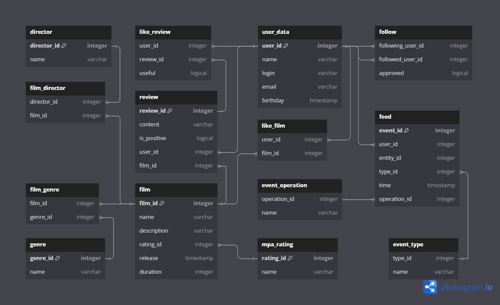

# Filmorate

### Описание проекта
Restful API back-end сервис для управления фильмами и отзывами.
#### Основные особенности проекта:
- Включает базу данных H2;
- Разработан с использованием фреймворка Spring Boot;
- 40 End-points доступных для управления данными.

## Содержание:
1. [Стэк проекта](#стэк-проекта)
2. [Функционал](#функционал)
3. [ER-диаграмма](#er-диаграмма)
4. [Файлы базы данных](#файлы-базы-данных)
6. [SQL-запросы](#sql-запросы)
7. [Ограничения полей (валидация данных)](#ограничения-полей-валидация-данных)
8. [Пошаговая инструкция по установке проекта](#пошаговая-инструкция-по-установке-проекта)
9. [Авторы](#авторы)


## Стэк проекта
- Java 11, Spring Boot, Maven, Lombok, Junit, JDBC, JdbcTest, SQL, H2, Postman
- Зависимости: [pom.xml](pom.xml)
- Тесты: [tests](docs/test_postman)

## Функционал
### EndPoints:
#### Фильмы:
+ GET /films - Получить все фильмы;
+ GET /films/{id} - Получить фильм;
+ POST /films - Добавить фильм;
+ PUT /films - Обновить фильм;
+ PUT /films/{id}/like/{userId} - Добавить лайк фильму;
+ DELETE /films/{id}/like/{userId} - Удалить лайк фильма;
+ DELETE /films/{id} - Удалить фильм.

#### Жанры фильмов:
+ GET /genres - Получить все жанры;
+ GET /genres/{id} - Получить жанр.

#### MPA-рейтинг фильмов (MPA возрастное ограничение):
+ GET /mpa - Получить все рейтинги фильмов;
+ GET /mpa/{id} - Получить рейтинг.

#### Режиссеры:
+ GET /directors - Получить всех режиссеров;
+ GET /directors/{id} - Получить режиссера;
+ POST /directors - Добавить режиссера;
+ PUT /directors - Обновить режиссера;
+ DELETE /directors/{id} - Удалить режиссера.

#### Пользователи:
+ GET /users - Получить всех пользователей;
+ GET /users/{id} - Получить пользователя;
+ GET /users/{id}/friends - Получить список друзей пользователя;
+ GET /users/{id}/friends/common/{otherId} - Получить список общих друзей с пользователем;
+ POST /users - Добавить пользователя;
+ PUT /users - Обновить пользователя;
+ PUT /users/{id}/friends/{friendId} - Добавить пользователя в друзья;
+ DELETE /users/{id}/friends/{friendId} - Удалить пользователя из друзей;
+ DELETE /users/{id} - Удалить пользователя;

#### Отзывы:
+ GET /reviews?filmId={filmId}&count={count} - Получить все отзывы фильма (count - количество отзывов);
+ GET /reviews/{id} - Получить отзыв;
+ POST /reviews - Добавить отзыв;
+ PUT /reviews/{id}/like/{userId} - Поставить лайк отзыву;
+ PUT /reviews/{id}/dislike/{userId} - Поставить дизлайк отзыву;
+ PUT /reviews - Обновить отзыв;
+ DELETE /reviews/{id}/like/{userId} - Удалить лайк/дизлайк отзыва;
+ DELETE /reviews/{id}/dislike/{userId} - Удалить дизлайк отзыва;
+ DELETE /reviews/{id} - Удалить отзыв.

Дополнительно:
#### Поиск:
+ GET /fimls/search - Получить список фильмов по названию фильмов и по режиссёру.

#### Общие фильмы:
+ GET /films/common?userId={userId}&friendId={friendId} - Получить общие с другом фильмы с сортировкой по их популярности.

#### Рекомендации
+ GET /users/{id}/recommendations - Получить рекомендации по фильмам для просмотра;

#### Лента событий
+ GET /users/{id}/feed - Получить ленту событий пользователя.

#### Сортировка режиссер
+ GET /films/director/{directorId}?sortBy=[year,likes] - Получить список фильмов режиссера по количеству лайков/году выпуска.

#### Популярные фильмы
+ GET /films/popular?count={limit}&genreId={genreId}&year={year} - Получить самые популярные фильмы по жанру и годам.


## ER-диаграмма



## Файлы базы данных

- [schema.sql](src/main/resources/schema.sql)
- [data.sql](src/main/resources/data.sql)


## SQL-запросы

### Фильмы
<details>
<summary>Таблица film</summary>

Примеры:
- Получить все фильмы
```sql
SELECT * 
FROM film;
```
- Получить фильм
```sql
SELECT * 
FROM film 
WHERE film_id = ?;
```
- Получить популярные фильмы (count - топ фильмов)
```sql
SELECT f.*
FROM film AS f
LEFT JOIN (SELECT film_id, COUNT(*) AS like_count
         FROM like_film
         GROUP BY film_id) l ON f.film_id = l.film_id
ORDER BY l.like_count DESC
LIMIT ?;
```
- Получить рейтинг фильмов режиссера по количеству лайков/году выпуска

По Year:
```sql
SELECT film.film_id
FROM film
JOIN film_director ON film.film_id = film_director.film_id
WHERE film_director.director_id = ?
ORDER BY film.release;
```
По Likes:
```sql
SELECT film.film_id
FROM film
JOIN film_director ON film.film_id = film_director.film_id
LEFT JOIN like_film ON film.film_id = like_film.film_id
WHERE film_director.director_id = ?
GROUP BY film.film_id
ORDER BY COUNT(like_film.film_id) DESC;
```
- Добавить фильм
```sql
INSERT INTO film (name, description, rating_id, release, duration) 
VALUES (?, ?, ?, ?, ?);
```
- Обновить фильм
```sql
UPDATE film 
SET name = ?,
   description = ?,
   rating_id = ?,
   release = ?,
   duration = ?
WHERE film_id = ?;
```
- Добавить лайк фильму
```sql
INSERT INTO like_film (film_id, user_id) 
VALUES (?, ?);
```
- Удалить лайк фильма
```sql
DELETE FROM like_film 
WHERE film_id = ? AND user_id = ?;
```
- Удалить фильм
```sql
DELETE FROM film
WHERE film_id = ?;
```
- Проверить фильма
```sql
SELECT COUNT(*) 
FROM film WHERE film_id = ?;
```
</details>


### Возрастной рейтинг
<details>
<summary>Таблица mpa_rating</summary>

Примеры:
- Получить все рейтинги фильмов
```sql
SELECT * 
FROM mpa_rating;
```
- Получить рейтинг
```sql
SELECT * 
FROM mpa_rating 
WHERE rating_id = ?;
```
- Проверить рейтинг
```sql
SELECT COUNT(*) 
FROM mpa_rating 
WHERE rating_id = ?;
```
</details>


### Жанры
<details>
<summary>Таблица genre</summary>

Примеры:
- Получить все жанры
```sql
SELECT * 
FROM genre;
```
- Получить жанр
```sql
SELECT * 
FROM genre WHERE genre_id = ?;
```
- Получить все жанры фильма
```sql
SELECT * 
FROM film_genre 
WHERE film_id = ?;
```
- Проверить жанр
```sql
SELECT COUNT(*) 
FROM genre 
WHERE genre_id = ?;
```
</details>


### Жанры фильма
<details>
<summary>Таблица film_genre</summary>

Примеры:
- Получить жанр фильма
```sql
SELECT genre_id 
FROM film_genre 
WHERE film_id = ?;
```
- Добавить жанры фильму
```sql
INSERT INTO film_genre (film_id, genre_id) 
VALUES (?, ?);
```
- Обновить жанры фильма
```sql
INSERT INTO film_genre (film_id, genre_id) 
VALUES (?, ?);
```
- Удалить жанр фильма
```sql
DELETE FROM film_genre 
WHERE film_id = ? AND genre_id = ?;
```
- Удалить все жанры фильма
```sql
DELETE FROM film_genre 
WHERE film_id = ?;
```
</details>


### Пользователи
<details>
<summary>Таблица user_data</summary>

Примеры:
- Добавить пользователя
```sql
INSERT INTO user_data (name, login, email, birthday) 
VALUES (?, ?, ?, ?);
```
- Обновить пользователя
```sql
UPDATE user_data 
SET name = ?, 
   login = ?, 
   email = ?, 
   birthday = ? 
WHERE user_id = ?;
```
- Получить пользователя
```sql
SELECT * 
FROM user_data 
WHERE user_id = ?;
```
- Получить всех пользователей
```sql
SELECT * 
FROM user_data;
```
- Проверить пользователя
```sql
SELECT COUNT(*) 
FROM user_data 
WHERE user_id = ?;
```
</details>

### Лайки фильмов
<details>
<summary>Таблица like_film</summary>

Примеры:
- Получить лайки пользователя
```sql
SELECT user_id 
FROM like_film WHERE film_id = ?;
```
- Добавить лайк фильму
```sql
INSERT INTO like_film (film_id, user_id) 
VALUES (?, ?);
```
- Удалить лайк фильма
```sql
DELETE FROM like_film 
WHERE film_id = ? AND user_id = ?;
```
</details>

### Друзья
<details>
<summary>Таблица follow</summary>

Примеры:
- Добавить в друзья
  В друзьях
```sql
UPDATE follow 
SET approved = ? 
WHERE target_id = ? AND follower_id = ?;
```
Не в друзьях
```sql
INSERT INTO follow (target_id, follower_id, approved) 
VALUES (?, ?, ?);
```
- Удалить из друзей
  В друзьях пользователя
```sql
DELETE FROM follow 
WHERE target_id = ? AND follower_id = ?;
```
В друзьях у пользователя
```sql
UPDATE follow 
SET approved = ? 
WHERE target_id = ? AND follower_id = ?;
```
Не в друзьях
```sql
DELETE FROM follow 
WHERE target_id = ? AND follower_id = ?;
```
- Получить всех друзей
```sql
SELECT * 
FROM user_data 
WHERE user_id IN (SELECT target_id 
                  FROM follow 
                  WHERE follower_id = ? 
                  AND approved = true) 
   OR user_id IN (SELECT follower_id 
                  FROM follow 
                  WHERE target_id = ?);
```
- Получить общих друзей с другим пользователем
```sql
SELECT u1.user_id, u1.email, u1.login, u1.birthday, u1.name 
FROM (SELECT * 
      FROM user_data 
      WHERE user_id IN (SELECT target_id 
                        FROM follow 
                        WHERE follower_id = ? 
                        AND approved = TRUE) 
         OR user_id IN (SELECT follower_id 
                        FROM follow 
                        WHERE target_id = ?)
      ) AS u1 
INNER JOIN (SELECT * 
            FROM user_data 
            WHERE user_id IN (SELECT target_id 
                              FROM follow 
                              WHERE follower_id = ? 
                              AND approved = TRUE) 
               OR user_id IN (SELECT follower_id 
                              FROM follow 
                              WHERE target_id = ?)
            ) AS u2 ON u1.user_id = u2.user_id;
```
- Получить id дорузей
```sql
SELECT user_id 
FROM user_data 
WHERE user_id IN (SELECT target_id 
                  FROM follow 
                  WHERE follower_id = ? 
                  AND approved = TRUE) 
   OR user_id IN (SELECT follower_id 
                  FROM follow 
                  WHERE target_id = ?);
```
- Проверить дружбу двух пользователей
```sql
SELECT COUNT(*) 
FROM follow 
WHERE target_id = ? AND follower_id = ? AND approved = ?;
```
</details>

### Режиссер
<details>
<summary>Таблица director</summary>

Примеры:
- Получить всех режиссеров
```sql
SELECT * 
FROM director;
```
- Получить режиссера
```sql
SELECT * 
FROM director 
WHERE director_id = ?;
```
- Добавить режиссера
```sql
INSERT INTO director (name) 
VALUES (?);
```
- Обновить режиссера
```sql
UPDATE director SET name = ? 
WHERE director_id = ?;
```
- Удалить режиссера
```sql
DELETE FROM director 
WHERE director_id = ?;
```
- Проверить режиссера
```sql
SELECT COUNT(*) 
FROM director 
WHERE director_id = ?;
```
</details>

### Фильмы режиссера
<details>
<summary>Таблица film_director</summary>

Примеры:
- Получить всех режиссеров фильма
```sql
SELECT * 
FROM film_director 
WHERE film_id = ?;
```
- Добавить режиссера к фильму
```sql
INSERT INTO film_director (film_id, director_id) 
VALUES (?, ?);
```
- Удалить режиссеров фильма
```sql
DELETE FROM film_director 
WHERE film_id = ?;
```
- Проверить режиссера фильма в БД
```sql
SELECT COUNT(*) 
FROM film_director 
WHERE director_id = ? AND film_id = ?;
```
</details>

### Отзывы
<details>
<summary>Таблица review</summary>

Примеры:
- Добавить отзыв
```sql
INSERT INTO review (content, user_id, film_id, is_positive) 
VALUES (?, ?, ?, ?);
```
- Обновить отзыв
```sql
UPDATE review 
SET content = ?, is_positive = ? 
WHERE review_id = ?;
```
- Получить отзыв
```sql
SELECT review_id, content, user_id, film_id, is_positive, 
       IFNULL((SELECT sum(CASE usefull WHEN true THEN 1 ELSE -1 END) 
               FROM like_review 
               WHERE review_id = r.review_id), 0) AS useful 
FROM review as r 
WHERE review_id = ?;
```
- Получить все отзывы
```sql
SELECT review_id, content, user_id, film_id, is_positive, 
       IFNULL((SELECT sum(CASE usefull WHEN true THEN 1 ELSE -1 END) 
               FROM like_review 
               WHERE review_id = r.review_id), 0) AS useful 
FROM review as r 
ORDER BY useful DESC 
LIMIT ?;
```
- Получить отзывы фильма
```sql
SELECT review_id, content, user_id, film_id, is_positive, 
       IFNULL((SELECT sum(CASE usefull WHEN true THEN 1 ELSE -1 END) 
               FROM like_review 
               WHERE review_id = r.review_id), 0) AS useful 
FROM review as r 
WHERE film_id = ? 
ORDER BY useful DESC 
LIMIT ?;
```
- Удалить отзыв
```sql
DELETE FROM review 
WHERE review_id = ?;
```
- Проверить отзыв
```sql
SELECT review_id 
FROM review 
WHERE review_id = ?;
```
</details>

### Лайки отзывов
<details>
<summary>Таблица like_review</summary>

Примеры:
- Добавить лайк отзыву
```sql
MERGE INTO like_review (user_id, review_id, usefull) 
VALUES (?, ?, true);
```
- Добавить дизлайк отзыву
```sql
MERGE INTO like_review (user_id, review_id, usefull) 
VALUES (?, ?, false);
```
- Удалить лайк отзыва
```sql
DELETE FROM like_review 
WHERE user_id = ? AND review_id = ?;
```
- Удалить дизлайк отзыва
```sql
DELETE FROM like_review WHERE user_id = ? AND review_id = ?
```
</details>

### История событий
<details>
<summary>Таблица user_event</summary>

- Получить ленту событий пользователя
```sql
SELECT f.event_id, 
        f.user_id,
        f.entity_id, 
        f.time, o.name 
    AS operation_name, et.name 
    AS type_name 
FROM feed f 
JOIN event_operation eo ON f.operation_id = eo.operation_id 
JOIN event_type et ON f.type_id = et.type_id 
WHERE f.user_id = ? 
ORDER BY f.time;
```
</details>

### Поиск
<details>
<summary>Таблица user_event</summary>

Примеры:
- По популярности
```sql
SELECT * 
FROM film_director 
WHERE film_id = ?;
```
- По режиссерам
```sql
SELECT * 
FROM director 
WHERE LOWER(name) LIKE ?;
```
- По году
```sql
SELECT film.film_id 
FROM film 
JOIN film_director ON film.film_id = film_director.film_id 
WHERE film_director.director_id = ? 
ORDER BY film.release;
```
- По лайкам
```sql
SELECT film.film_id 
FROM film 
JOIN film_director ON film.film_id = film_director.film_id 
LEFT JOIN like_film ON film.film_id = like_film.film_id 
WHERE film_director.director_id = ? 
GROUP BY film.film_id 
ORDER BY COUNT(like_film.film_id) DESC;
```
</details>

### Популярность фильмов
<details>
<summary>Таблица user_event</summary>

Примеры:
- По жанру и году
```sql
SELECT f.* 
FROM film f 
LEFT JOIN like_film lf on f.film_id = lf.film_id 
LEFT JOIN film_genre fg ON f.film_id = fg.film_id 
WHERE fg.genre_id = ? AND year(f.release) = ? 
GROUP BY f.film_id, fg.genre_id 
ORDER BY COUNT(lf.user_id) DESC 
LIMIT ?;
```
- По жанру
```sql
SELECT f.* 
FROM film f 
LEFT JOIN like_film lf on f.film_id = lf.film_id 
LEFT JOIN film_genre fg ON f.film_id = fg.film_id 
WHERE fg.genre_id = ? 
GROUP BY f.film_id, fg.genre_id 
ORDER BY COUNT(lf.user_id) DESC 
LIMIT ?;
```
- За указаный год
```sql
SELECT f.* 
FROM film f 
LEFT JOIN like_film lf on f.film_id = lf.film_id 
WHERE year(f.release) = ? 
GROUP BY f.film_id 
ORDER BY COUNT(lf.user_id) DESC 
LIMIT ?;
```
</details>


## Ограничения полей (валидация данных)

### Users (пользователи)
- "user_id" может быть только положительным;
- "email" не может быть пустым, не может содержать пробелы. Пример: example@example.example;
- "login" не может быть пустым;
- "name" может быть не заполнен, при этом будет использован email адрес;
- "birthday" не может быть пустым, не может быть в будущем;

### Films (фильмы)
- "film_id" может быть только положительным;
- "name" не может быть пустым;
- "description" не может быть пустым, минимальная длина описания - 1 символ, максимальная длина описания — 200 символов;
- "release" не может быть пустым, дата релиза фильма — не раньше 28 декабря 1895 года;
- "duration" не может быть пустым, продолжительность фильма должна быть положительной;
- "rating_id" возрастной рейтинг не может быть пустым;

### Review (отзывы)
- "content" описание не может быть пустым;
- "userId" не может быть пустым;
- "filmId" не может быть пустым;

### Director (режиссер)
- "name" имя не может быть пустым.

## Пошаговая инструкция по установке проекта

1. Установите Git: Если у вас еще не установлен Git, загрузите и установите его с официального сайта
   Git: https://git-scm.com/.
2. Клонируйте репозиторий: Откройте командную строку или тер минал и выполните команду клонирования для репозитория
   GitHub. Например:

```
git clone https://github.com/Remsely/java-filmorate.git
```

3. Откройте проект в IDE: Откройте вашу среду разработки (IDE), такую как IntelliJ IDEA, Eclipse или NetBeans.
4. Импортируйте проект как Maven проект: Если вы используете IntelliJ IDEA,
   выберите File -> Open и выберите папку, в которую был склонирован репозиторий.
   IntelliJ IDEA должна автоматически распознать проект как Maven проект и импортировать его.
   В Eclipse вы можете выбрать File -> Import -> Existing Maven Projects и выбрать корневую папку проекта.
   В NetBeans вы можете выбрать File -> Open Project и выбрать папку проекта.
5. Запустите приложение: точка входа находится в классе "FilmorateApplication" помеченном аннотацией
   @SpringBootApplication.
   Либо запустите через Maven:

```
mvn spring-boot:run
```

## Авторы
- "Remsely", "4IPE·he/him", "SidyakinV", "KoryRunoMain", "Anastasia-star-star" 