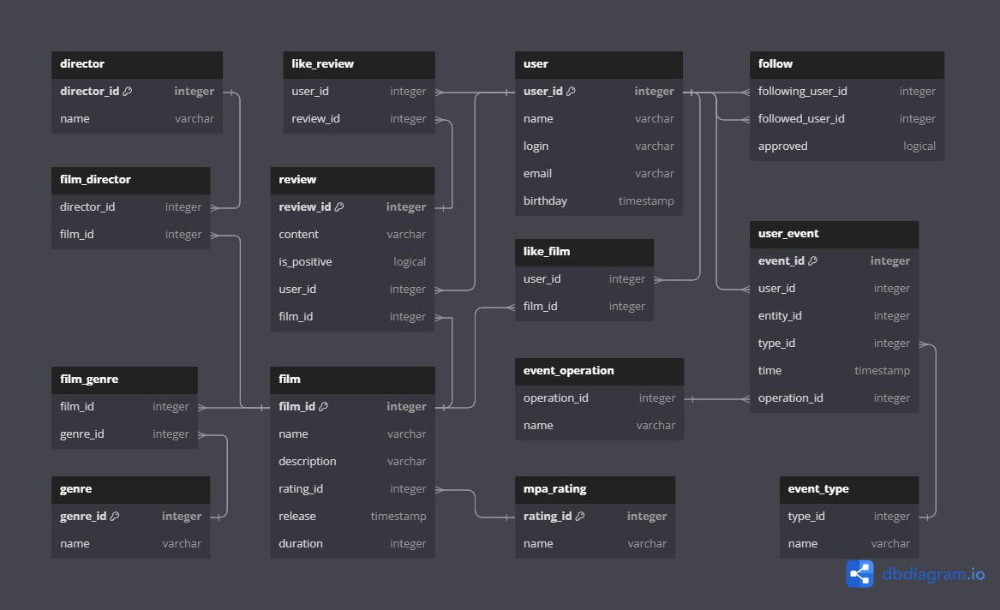

# Filmorate

## Описание проекта

** Restful API back-end сервис для приложения любителей кино. Включает хранение и управление:
фильмами, пользователями, режиссерами, жанрами, рейтингом, отзывами, рекомендациями, оценками и событиями пользователей.**

## Содержание:

- [Стэк технологий](#стэк-технологий)
- [Функционал](#функционал)
- [ER-диаграмма](#er-диаграмма)
- [Описание ER-диаграммы](#описание-er-диаграммы)
- [Файлы базы данных](#файлы-базы-данных)
- [SQL-запросы](#sql-запросы)
- [Ограничения полей (валидация данных)](#ограничения-полей-валидация-данных)
- [Пошаговая инструкция по установке проекта](#пошаговая-инструкция-по-установке-проекта)


## Стэк технологий
+ Java 11, Spring Boot, Maven, Lombok, Junit, JDBC, SQL, H2

## Функционал
Приложение представляет собой Rest-API, реализующее следующие endpoints:

### Фильмы:
+ GET /films - Получить все фильмы;
+ GET /films/{id} - Получить фильм;
+ GET /films/popular?count={count} - Получить популярные фильмы (count - топ фильмов);
+ GET /films/director/{directorId}?sortBy=[year,likes] - Получить рейтинг фильмов режиссера по количеству лайков/году выпуска;
+ POST /films - Добавить фильм;
+ PUT /films - Обновить фильм;
+ PUT /films/{id}/like/{userId} - Добавить лайк фильму;
+ DELETE /films/{id}/like/{userId} - Удалить лайк фильма;
+ DELETE /films/{id} - Удалить фильм.

### Жанры фильмов:
+ GET /genres - Получить все жанры фильмов;
+ GET /genres/{id} - Получить жанр фильма.

### MPA-рейтинг фильмов (MPA возрастное ограничение):
+ GET /mpa - Получить все рейтинги фильмов;
+ GET /mpa/{id} - Получить рейтинг.

### Пользователи:
+ GET /users - Получить всех пользователей;
+ GET /users/{id} - Получить пользователя;
+ GET /users/{id}/friends - Получить список друзей пользователя;
+ GET /users/{id}/friends/common/{otherId} - Получить список общих друзей с пользователем;
+ POST /users - Добавить пользователя;
+ PUT /users - Обновить пользователя;
+ PUT /users/{id}/friends/{friendId} - Добавить пользователя в друзья;
+ DELETE /users/{id}/friends/{friendId} - Удалить пользователя из друзей;
+ DELETE /users/{id} - Удалить пользователя;

### Режиссеры:
+ GET /directors - Получить всех режиссеров;
+ GET /directors/{id} - Получить режиссера;
+ POST /directors - Добавить режиссера;
+ PUT /directors - Обновить режиссера;
+ DELETE /directors/{id} - Удалить режиссера.

### Отзывы:
+ GET /reviews?filmId={filmId}&count={count} - Получить все отзывы фильма (count - количество отзывов);
+ GET /reviews/{id} - Получить отзыв;
+ POST /reviews - Добавить отзыв;
+ PUT /reviews/{id}/like/{userId} - Поставить лайк отзыву;
+ PUT /reviews/{id}/dislike/{userId} - Поставить дизлайк отзыву;
+ PUT /reviews - Обновить отзыв;
+ DELETE /reviews/{id}/like/{userId} - Удалить лайк/дизлайк отзыва;
+ DELETE /reviews/{id}/dislike/{userId} - Удалить дизлайк отзыва;
+ DELETE /reviews/{id} - Удалить отзыв.

## ER-диаграмма



## Описание ER-диаграммы

## Файлы базы данных

## SQL-запросы

## Ограничения полей (валидация данных)

## Пошаговая инструкция по установке проекта

1. Установите Git: Если у вас еще не установлен Git, загрузите и установите его с официального сайта
   Git: https://git-scm.com/.
2. Клонируйте репозиторий: Откройте командную строку или тер минал и выполните команду клонирования для репозитория
   GitHub. Например:

```
git clone https://github.com/Remsely/java-filmorate.git
```

3. Откройте проект в IDE: Откройте вашу среду разработки (IDE), такую как IntelliJ IDEA, Eclipse или NetBeans.
4. Импортируйте проект как Maven проект: Если вы используете IntelliJ IDEA,
   выберите File -> Open и выберите папку, в которую был склонирован репозиторий.
   IntelliJ IDEA должна автоматически распознать проект как Maven проект и импортировать его.
   В Eclipse вы можете выбрать File -> Import -> Existing Maven Projects и выбрать корневую папку проекта.
   В NetBeans вы можете выбрать File -> Open Project и выбрать папку проекта.
5. Запустите приложение: точка входа находится в классе "FilmorateApplication" помеченном аннотацией
   @SpringBootApplication.
   Либо запустите через Maven:

```
mvn spring-boot:run
```


## Функционал

Приложение представляет собой Rest-API, реализующее следующие эндпоинты:

+ 
+ 
+ 
+ 
+ DELETE /users/{id}/friends/{friendId} - Удаление пользователя friendId из друзей пользователя id;
+ 
+ 


## Архитектура БД

Схема базы данных приложения представлена на рисунке.


### Примеры запросов к БД

**Получение пользователя по ID**

```postgresql
SELECT *
FROM user
WHERE user_id = id;
```

**Получение фильма по ID**

```postgresql
SELECT *
FROM film
WHERE film_id = id;
```

**Получение списка друзей пользователя по ID**

```postgresql
SELECT followed_user_id
FROM follow
WHERE following_user_id = id
  AND approved = true;
```

**Получение списка общих друзей пользователей id и otherId**

```postgresql
SELECT followed_user_id
FROM follow
WHERE following_user_id = otherId
  AND followed_user_id IN (SELECT followed_user_id
                           FROM follow
                           WHERE following_user_id = id
                             AND approved = true)
  AND approved = true;
```

**Получение первых counter фильмов по кол-ву лайков**

```postgresql
SELECT film_id
FROM like
GROUP BY film_id
ORDER BY COUNT(user_id) DESC
LIMIT counter;
```